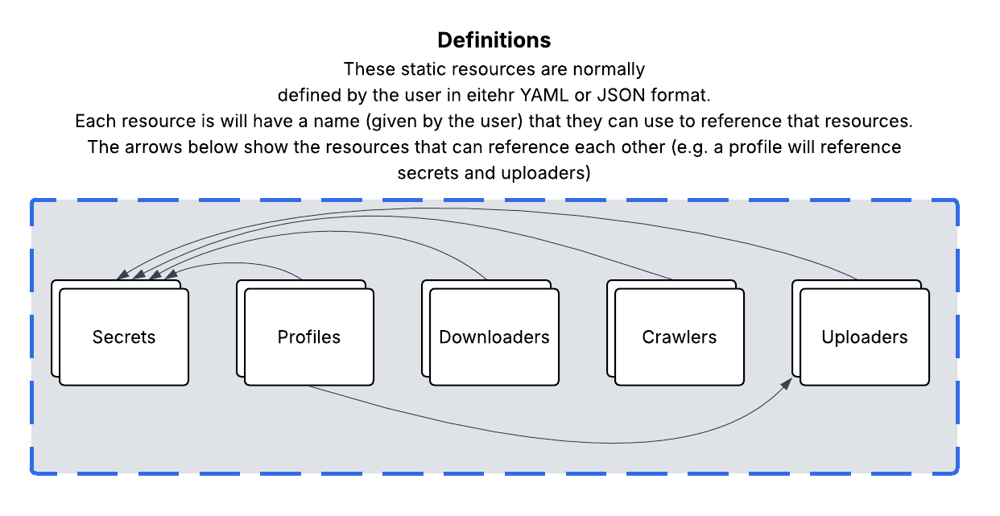
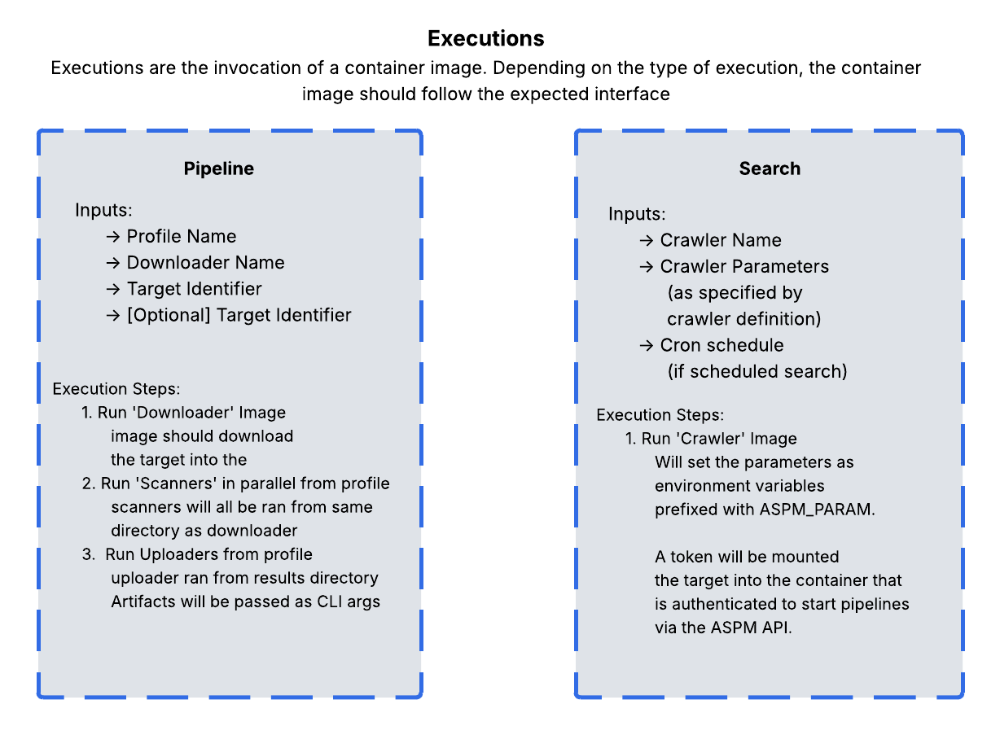

 

	<h1 align="center">Ocular</h1>
    
  

        an API built onto of Kubernetes that allows you to perform regular or ad-hoc security scans over static software assets.
        It provides a set of RESTful endpoints that allow you to configure and run security or compliance scanning tools.
  

## Overview

Ocular is a Kubernetes-native API that allows you to perform security scans on static software assets.
It provides a set of RESTful endpoints that allow you to configure and run security or compliance scanning tools over static software assets,
such as git repositories, container images, or any static content that can be represented on a file system.

It is designed to allow for both regular scans on a scheduled basis or, ad-hoc security scans ran on demand.
The system allows for the user to customize not only the scanning tools that are used, but also:
- How scan targets are enumerated (e.g. git repositories, container images, etc.)
- How those scan targets are downloaded into the scanning environment (e.g. git clone, container pull, etc.)
- How the scanning tools are configured and run (e.g. custom command line arguments, environment variables, etc.)
- Where the results are sent (e.g. to a database, to a file, to a cloud storage etc.)

Each of these components can be configured independently, allowing for a high degree of flexibility and customization.
Each of the 4 components (enumeration, download, scanning, and results) can be customized via a container image that implements a specific interface,
normally through environment variables, command line arguments and file mounts.

## Usage

Ocular is configured via the definition of a few "resources", which are static definitions in YAML (or JSON) format and define 
a container image to run, secrets, or some configuration options for the scanning process.

These resources are then used to configure the scanning process and are read during the execution of container images.

### Definitions

Below are a list of all resources that are defined in the system, for more information on each, follow the links to the documentation for each resource:
- [**Secrets**](/docs/definitions/SECRETS.md): Used to store sensitive information, such as API keys, passwords, etc. These are stored in Kubernetes secrets and can be referenced in the other resources.
- [**Downloaders**](/docs/definitions/DOWNLOADERS.md): A container image that will be passed a 'target' (an identifer and optional version) and will be execpted to
write the downloaded content to a specific directory in the container filesystem. This will run before the scanners in the same directory.
- [**Uploader**](/docs/definitions/UPLOADERS.md): A container image that will be passed the resulting artifact paths from all scans on a given target and is expected to upload them to a specific location, such as a database, cloud storage, etc.
- [**Profiles**](/docs/definitions/PROFILES.md): A collection of containers to run on the downloaded target. Each profile defines a set of container images to run, \
along with any command line arguments or environment variables that should be passed to the container.
Additionally, profiles will define the artifacts that the scanners will produce, and a list of uploaders to send those artifacts to.
- [**Crawler**](/docs/definitions/CRAWLERS.md): A container that will be used to enumerate the targets to scan. It can be ran on a schedule or on demand.
The definition can define a set of parameters that should be given when invocated. When the container runs, it will have
an authenticated token to the API, and will be expected to call the API to invoke start scans or other crawlers.

### Executions

Below are two main types of executions in the system, for more information on each, follow the links to the documentation for each execution type:
- [**Pipelines**](docs/executions/PIPELINES.md): This accepts a target identifier (normally a URL), an optional target version, the name of the downloader to use, and a profile to run.
The execution starts by running the downloader with the target identifier and version set as environment variables.
The downloader is expected to download the target content to its current working director. Once the container exists (with code 0),
The scanners listed in the profile are executed in parallel, with the target directory mounted as a volume.
The scanners should produce artifacts into the 'artifacts' directory in the container filesystem (the path is given as the `OCULAR_ARTIFACTS_DIR` environment variable). 
Once all scanners have completed, The uploaders are executed in parallel with the paths of the artifacts produced as command line arguments.

- [**Search**](docs/executions/SEARCHES.md): A search is a run of a crawler, which is a container that will enumerate targets to scan.
Searches can be run on a schedule or on demand.
It accepts the name of the crawler to run, and any parameters that should be passed to the crawler. 
The system will mount an authenticated token to the API in the container inside a file, 
which the environment variable `OCULAR_SERVICE_ACCOUNT_TOKEN_PATH` has the path to this file.
The base URL of the API is also provided as an environment variable `OCULAR_API_BASE_URL`.

## OpenAPI

An OpenAPI specification is available in the repo at [`docs/openapi.yaml`](/docs/swagger/openapi.yaml).
Additionally, if the server is run in development mode (i.e. `OCULAR_ENV=development`),
the OpenAPI specification will be served at the `/api/swagger/openapi.json` endpoint and 
a swagger UI will be available at `/api/swagger/`.

## Getting started

### Installation via Helm

Please see the Helm chart documentation at [artifact hub](https://artifacthub.io/packages/helm/crash-override/ocular) for the latest version of the chart.

### Running locally

See [DEVELOPMENT.md](docs/DEVELOPMENT.md) for instructions on how to run the application locally.

